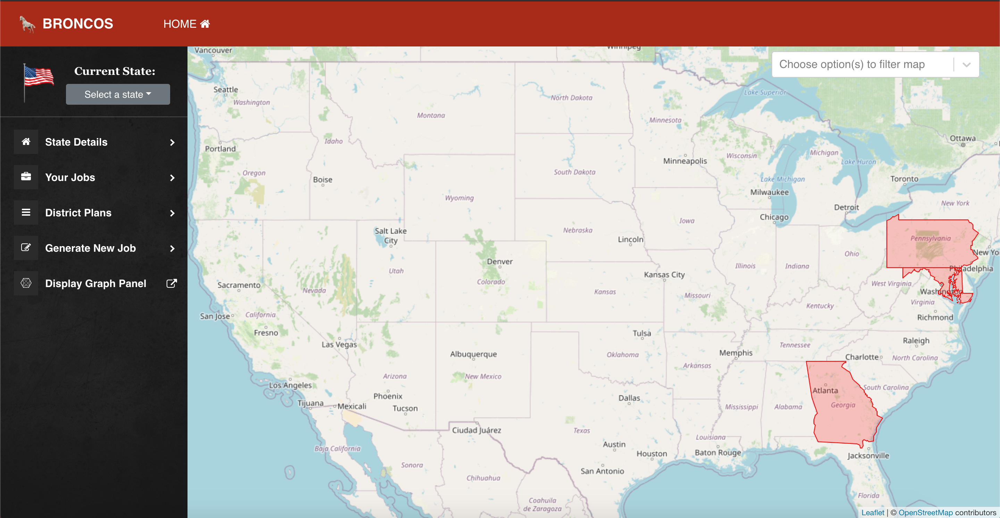
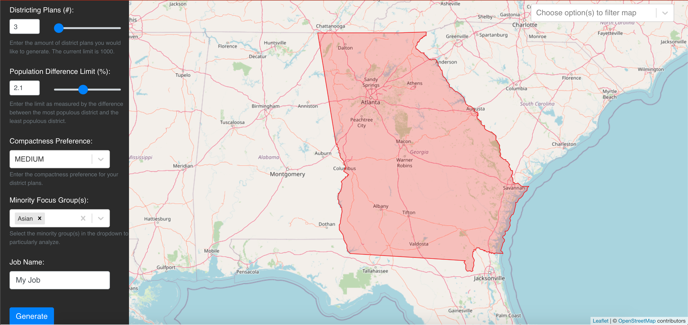
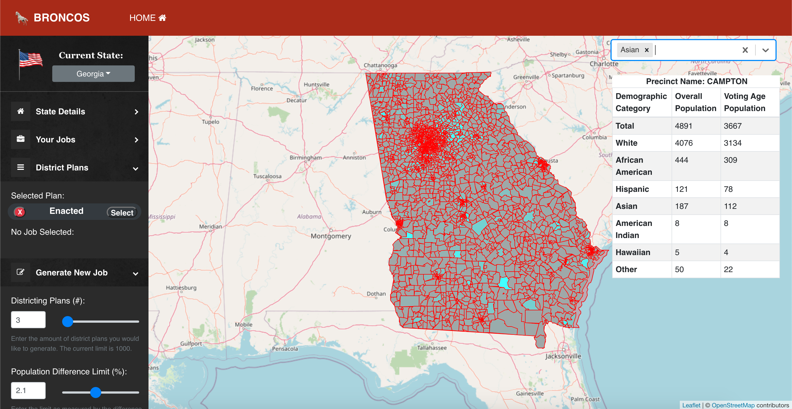
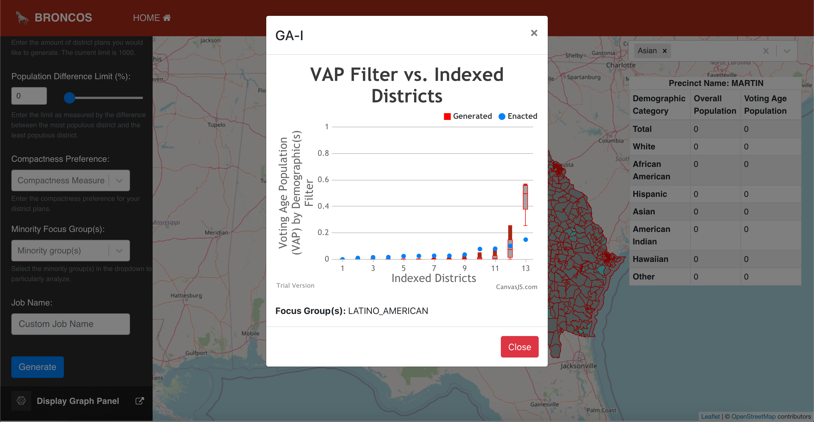

# CSE-416-Project
A collaborative project, this web application implements a React-based frontend with stylization tools such as Materialize, and Bootstrap. Communication is structured through a REST API, facilitating communication between the front and back ends. The core of the project, being the Algorithm to generate new districting plans, is provided via Python and is executed through scripting commands to interact with Stony Brook's powerful server --- the "SeaWulf". 

•	Tools used:   JavaScript,   Python,   React,   Bash,   MySQL,   Spring MVC,   Rest API,   Bootstrap,   Maven,   Slurm

